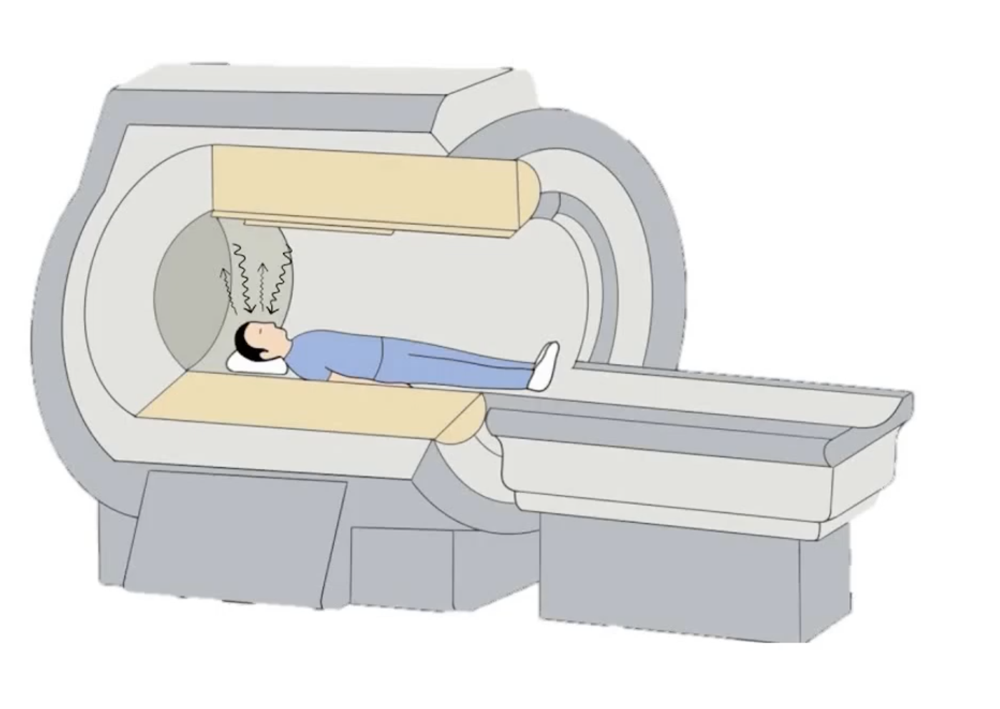
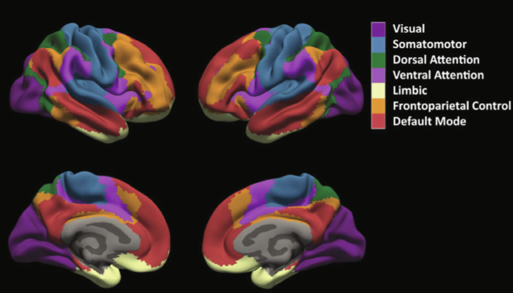
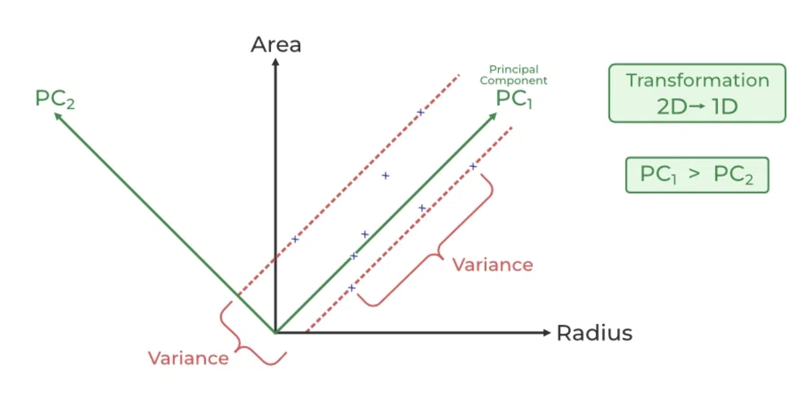

# Analyse de la Connectivité Fonctionnelle dans l’Autisme avec ABIDE

## Présentation générale du projet

Ce projet s’inscrit dans le cadre de l’étude de la **connectivité fonctionnelle cérébrale** chez les individus avec **trouble du spectre de l’autisme (TSA)** comparés à des sujets typiques au développement (TDC).  
L’analyse repose sur le **jeu de données ABIDE (Autism Brain Imaging Data Exchange)**, une base de référence internationale rassemblant des données d’IRM fonctionnelle au repos (rs-fMRI) collectées dans de multiples centres de recherche à travers le monde.  

### Trouble du spectre autistique

Le trouble du spectre autistique (TSA) est un trouble neurodéveloppemental caractérisé par des altérations de la communication sociale et par la présence de comportements restreints et répétitifs. Sur le plan neurobiologique, il est de plus en plus compris comme un **trouble de la connectivité cérébrale**. [[1](https://en.wikipedia.org/wiki/Autism)]

De nombreuses études en neuroimagerie ont mis en évidence des profils atypiques de connectivité, traduits par :  
- des **anomalies intra-réseaux**, c’est-à-dire des modifications de la synchronisation fonctionnelle au sein d’un même système cérébral, 
- et des **anomalies inter-réseaux**, impliquant des altérations dans la communication entre grands réseaux fonctionnels (par exemple, entre réseaux d’attention, réseaux sensoriels et systèmes de contrôle exécutif). [[2](https://www.aging-us.com/article/205913)]

L’étude de ces patterns atypiques constitue aujourd’hui un axe central de la recherche sur l’autisme, car ils pourraient refléter des mécanismes fondamentaux expliquant les différences cognitives et comportementales observées dans le TSA.


## 1. Jeux de données et prétraitement

### Le projet ABIDE

Le **projet ABIDE (Autism Brain Imaging Data Exchange)**, lancé en 2012 (Di Martino et al., 2014), constitue l’une des plus grandes initiatives de mise en commun de données d’IRM fonctionnelle chez des individus avec autisme.[[3](https://fcon_1000.projects.nitrc.org/indi/abide/)]

<div style="text-align:center;">
  
  <div style="font-style:italic;color:#666;"></div>
</div>

<br>


ABIDE réunit les acquisitions réalisées dans **plus de 20 centres internationaux**, incluant à la fois des patients TSA et des témoins TDC, avec des profils variés en termes d’âge et de caractéristiques cliniques.  
L’objectif est de favoriser la **reproductibilité** et la **comparabilité** des recherches en fournissant une base harmonisée, librement accessible à la communauté scientifique.


Les données brutes incluent :
- des séries IRMf au repos (*resting-state fMRI*), 
- des images anatomiques T1
- des fichiers **phénotypiques** (diagnostic, âge, sexe, site d’acquisition, etc.).


<div style="text-align:center;">
  
  <div style="font-style:italic;color:#666;">Figure – Coupe anatomique du sujet 51464</div>
</div>


---
### L’IRMf au repos (rs-fMRI)
L’IRM fonctionnelle au repos mesure les fluctuations spontanées du signal BOLD (Blood Oxygen Level Dependent) lorsque le sujet est **allongé dans le scanner, les yeux fermés ou fixant une croix, sans tâche particulière à effectuer**.  

<div style="text-align:center;">
  
  <div style="font-style:italic;color:#666;">Illustration du protocole d’IRM fonctionnelle au repos (rs-fMRI)</div>
</div>

 <br>

Quand une région cérébrale est plus active, elle consomme davantage d’oxygène. Le flux sanguin augmente alors pour compenser, ce qui modifie la proportion d’hémoglobine oxygénée et non oxygénée.

Ces changements entraînent une variation du contraste mesuré par l’IRM :

- initial dip : légère baisse liée à la consommation d’oxygène,
- peak : augmentation due à l’afflux de sang oxygéné,
- undershoot : retour progressif à l’équilibre après l’activité.

<div style="text-align:center;">
  
  <div style="font-style:italic;color:#666;">Réponse hémodynamique BOLD : évolution temporelle après un stimulus</div>
</div>

<br>

Ces fluctuations reflètent une activité cérébrale intrinsèque et synchronisée entre régions, appelée **connectivité fonctionnelle au repos**.  
Ce paradigme présente plusieurs avantages dans l’étude de l’autisme :  
- il est **peu contraignant** pour les participants   
- il facilite la **comparaison inter-sites** (protocole standardisé)
- il reflète l’**activité intrinsèque du cerveau**, en mettant en évidence des réseaux liés à l’**introspection, la mémoire autobiographique, le rapport à soi et aux autres** — des dimensions souvent atypiques dans le TSA. [[4](https://en.wikipedia.org/wiki/Default_mode_network)]
<br>
---
<br>

En pratique, une IRMf de repos produit des données **4D** :  
- trois dimensions spatiales (x, y, z → voxels),  
- une dimension temporelle (t → volumes acquis toutes les TR, typiquement 2s).  

Chaque voxel fournit donc une **série temporelle d’intensité BOLD**, qui reflète l’activité locale au cours du temps. 

<div style="text-align:center;">
  
  <div style="font-style:italic;color:#666;"> Organisation du signal fMRI : <br> De la dimension 4D au voxel - extraction des séries temporelles </div>
</div>

<br>


<details>
<summary><b>Exemple pédagogique (brut 4D aplati)</b></summary>

Chaque ligne correspond à **un voxel (X,Y,Z) à un TR donné** :

<p align="center">

| TR | X  | Y  | Z  | Intensité BOLD |
|----|----|----|----|-----------------|
| 1  | 32 | 30 | 15 | 128             |
| 1  | 32 | 31 | 15 | 132             |
| 1  | 33 | 30 | 15 | 140             |
| 2  | 32 | 30 | 15 | 130             |
| 2  | 32 | 31 | 15 | 135             |
| 2  | 33 | 30 | 15 | 142             |

</p>

Fichier réel : **NIfTI 4D** (ex. `64×64×36×200`).

</details>

---
### Cohorte utilisée
L'étude s'appuie sur **ABIDE I** (Di Martino et al., 2014), qui rassemble **1112 jeux de données rs-fMRI** et phénotypes associés.  Dans ce projet, nous exploitons directement la distribution **ABIDE Preprocessed** (voir ci-dessous).


### Prétraitement des données (ABIDE Preprocessed)
Pour limiter l’hétérogénéité multi-sites, ABIDE propose des jeux **prétraités** via plusieurs pipelines : **CPAC**, **CCS**, **DPARSF**, **NIAK**, développer par diverses équipes scientifiques. [[5](https://preprocessed-connectomes-project.org/abide/Pipelines.html)]


Dans ce projet, nous avons retenu les paramètres suivants : 
- **Pipeline : `cpac`**  
  CPAC (*Configurable Pipeline for the Analysis of Connectomes*) est un pipeline modulaire et largement utilisé dans la connectomique fonctionnelle.  [[6](https://preprocessed-connectomes-project.org/abide/cpac.html)]
  Il intègre les étapes essentielles du prétraitement :  
  - **Correction du mouvement** : réaligner les volumes successifs pour compenser les déplacements de la tête.  
  - **Co-enregistrement avec l’anatomique T1** : aligner l’IRM fonctionnelle sur l’IRM structurelle du sujet.  
  - **Normalisation MNI** : projeter les données dans un espace standardisé pour permettre les comparaisons inter-sujets.  
  - **Régression des signaux de nuisance** : supprimer les fluctuations non neuronales (ex. bruit physiologique, LCR).  
  - **Filtrage temporel** : conserver la bande [0.01–0.1 Hz], typiquement associée à la connectivité fonctionnelle.  
  - **Lissage spatial** : améliorer le rapport signal/bruit en moyennant localement le signal.  

- **Stratégie de nettoyage : `filt_global`**  
  Inclut le filtrage temporel et la **régression du signal global**, une méthode débattue mais fréquemment utilisée dans ABIDE, qui favorise la comparabilité des analyses multi-sites. [[7](https://pmc.ncbi.nlm.nih.gov/articles/PMC6585462/)]
- **Dérivé : `rois_cc400`**  
  Séries temporelles **moyennes par région** de l’atlas **Craddock 400**, utilisé pour réduire la dimensionnalité et représenter le cerveau par 400 régions d'interêts (voir détails ci-après).  


**Contrôle qualité – Framewise Displacement (FD).**  
Le **FD** mesure le **déplacement de la tête d’un TR au suivant** (somme des variations absolues des translations et rotations). Nous **excluons** les sujets avec **FD moyen ≥ 0,2 mm**, seuil couramment employé pour réduire les artefacts de mouvement. [[8](https://wiki.cam.ac.uk/bmuwiki/FMRI)]


### Parcellisation et atlas Craddock 400 (CC400)
Une IRMf brute comporte des dizaines de milliers de voxels, ce qui rend les analyses directes très coûteuses et bruitées.  
Pour réduire cette **grande dimensionnalité**, on utilise des **atlas de parcellisation** : le cerveau est découpé en un nombre limité de **régions d’intérêt (ROIs - *Regions of interest*)**, chacune représentant un regroupement spatialement et fonctionnellement cohérent de voxels.  [[9](https://www.nitrc.org/projects/cluster_roi)]

L’atlas **Craddock 200 (CC200)** a été initialement construit par clustering spectral contraint sur des données de repos de 41 individus :  
- chaque voxel était traité comme un nœud d’un graphe,  
- les corrélations temporelles significatives entre voxels formaient les arêtes,  
- les graphes individuels ont été agrégés et partitionnés en **200 régions fonctionnelles**,  
- les ROIs ont ensuite été annotés en fonction de leur recouvrement avec des atlas de référence (AAL, Harvard-Oxford, Talairach).

La même procédure a été appliquée pour créer **l’atlas CC400**, cette fois avec **400 régions**, offrant une parcellisation plus fine.  
Cet atlas est particulièrement adapté à l’étude de la connectivité fonctionnelle car il équilibre :  
- une granularité suffisante pour détecter des effets régionaux,  
- et une dimensionnalité réduite par rapport au voxelwise (400 séries temporelles au lieu de >50 000).  


<div style="text-align:center;">
  
  <div style="font-style:italic;color:#666;">Figure - Craddock 400 Atlas </div>
</div>

<br>


---
### Fichiers générés : séries temporelles par ROI
Après parcellisation, chaque ROI est représenté par la **moyenne du signal BOLD de tous les voxels qui le composent**.
On obtient alors, pour chaque sujet, un fichier **`.1D`** contenant une série temporelle par ROI :  
- **Colonnes** = ROIs de l’atlas CC400 (400 au total).  
- **Lignes** = volumes temporels (TRs).  


Exemple d’un fichier `.1D` (série temporelle de 4 TR sur 5 ROIs) :  

| TR | ROI_1  | ROI_2   | ROI_3   | ROI_4   | ROI_5   |
|----|--------|---------|---------|---------|---------|
| 1  | 1.28   | -22.46  | -4.99   | -6.03   | 10.38   |
| 2  | 1.53   | -30.91  | -7.21   | -2.87   | 6.87    |
| 3  | -4.30  | -24.73  | 15.96   | -1.26   | 1.01    |
| 4  | -11.17 | -11.16  | 12.95   | -3.18   | -0.73   |
 


Le téléchargement des données **ABIDE preprocessed** (pipeline CPAC, atlas CC400) se fait directement via le script :  

```bash
python3 -m 0_download_data.download_abide_preprocessed_data
```

Ces fichiers représentent donc la base à partir de laquelle les **matrices de connectivité fonctionnelle** seront calculées.

## 2. Aperçu du **pipeline** & architecture du repo


Avant de détailler la construction des matrices de connectivité, voici un aperçu synthétique du pipeline implémenté.

Le dépôt est structuré en plusieurs modules correspondant aux grandes étapes du pipeline d’analyse de la connectivité fonctionnelle dans l’autisme avec ABIDE.  
Chaque dossier regroupe les scripts associés à une étape bien définie, pour en faciliter sa lisibilité et sa réutilisation.

---


### 2.1 Logique générale du pipeline

Le pipeline est structuré en étapes séquentielles, de l’acquisition des données jusqu’à la visualisation :

0. **Téléchargement des données prétraitées**  
   - Récupération des données ABIDE (pipeline CPAC, atlas CC400)  
   - Import des métadonnées cliniques associées

1. **Préparation et organisation des données**  
   - Nettoyage et harmonisation des phénotypes (diagnostic, âge, site, sexe)  
   - Analyse de distribution de covariables (âge, sexe, site) au sein des deux groupes (ASD - TDC)

2. **Extraction des matrices de connectivité fonctionnelle**  
   - Calcul des matrices sujet × ROI × ROI à partir des séries temporelles (corrélations de Pearson)  
   - Transformation de Fisher z  
   - Régression des covariables (âge, sexe, site…) pour corriger les matrices 

3. **Construction des scores de réseau**  
   - Mapping des ROIs avec réseaux fonctionnels (Yeo, Harvard-Oxford)  

4. **Analyses statistiques**  
    - Réduction dimensionnelle des connexions intra- et inter-réseaux par **PCA**  
    - Application de **sparsity** pour conserver les arêtes les plus informatives
    - Comparaison inter-groupes (ASD vs TDC) sur les scores de réseaux  avec correction multiples par **FDR**  
 
6. **Visualisation**  
   - Génération de **connectomes** (graphes réseau)  
   - Représentations en **surface corticale** et **heatmaps**  
   - Rapport synthétiques des résultats


### 2.2 Arborescence du dépôt
```
ABIDE_pipeline/
│
├── 0_download_data/                    # Téléchargement des données ABIDE prétraitées
│   └── download_abide_preprocessed_data.py
│
├── 1_data_cleaning/                    # Nettoyage et préparation des phénotypes
│   └── 1_load_and_clean_pheno.py
│
├── 2_connectivity_extraction/
│   ├── 1_compute_connectivity.py       # Construction des matrices ROI×ROI
│   └── 2_regress_covariates.py         # Régression optionnelle des covariables
│
├── 3_annotation_networks/
│   ├── 1_map_roi_to_HO.py              # Mapping vers atlas Harvard-Oxford
│   └── 2_map_roi_to_yeo.py             # Mapping vers réseaux Yeo-7
│
├── 4_statistics/
│   ├── 1_build_network_scores.py       # Construction des scores intra/inter-réseaux
│   └── 2_run_ttest.py                  # Tests statistiques inter-groupes + correction FDR
│
├── 5_visualization/
│   ├── 1_summary_table.py              # Table récapitulative des résultats
│   ├── 2_build_heatmap.py              # Heatmap des t-scores
│   ├── 3_1_compute_tscore_roi.py       # Calcul des t-scores par ROI
│   ├── 3_2_plot_surface_tscore.py      # Projection des t-scores en surface
│   └── 4_connectome.py                 # Visualisation du connectome réseau
│
├── artifacts/                          # Résultats générés (CSV, NPY, figures…)
├── atlases/                            # Fichiers d’atlas utilisés
├── Images/                             # Figures et schémas explicatifs
├── _run_pipeline.py                    # Script maître pour exécuter le pipeline
├── README.md                           # Documentation principale
├── requirements.txt                    # Dépendances Python
└── utils_*.py                          # Fonctions utilitaires (I/O, connectivité…)

```

### 2.3 Installation & exécution

Avant de lancer le pipeline, installer les dépendances :  

```bash
pip install -r requirements.txt
```

Le pipeline complet est exécutable via :
```bash
python3 _run_pipeline.py
```

## 3. Construction des matrices de connectivité fonctionnelle

La connectivité fonctionnelle (CF) désigne la **corrélation statistique des fluctuations de l’activité BOLD** entre différentes régions d’intérêt (ROIs) du cerveau au repos.  
Dans ce projet, la CF est représentée sous la forme de matrices ROI×ROI obtenues à partir des données ABIDE prétraitées.

---

### 3.1 Préparation des données phénotypiques et QC
Avant la construction de ces matrices, il est indispensable de **nettoyer et harmoniser** les données phénotypiques (données cliniques, démographiques) afin de garantir la cohérence entre sujets et fichiers .1D (séries temporelles régionales).

Le script de cleaning (`1_load_and_clean_pheno`) réalise plusieurs opérations clés :  

- **Normalisation et filtrage des identifiants de sujets (FILE_ID)** : suppression des entrées invalides ou sans IRMf exploitable.  
- **Exclusion automatique** des sujets dont les fichiers .1D sont manquants, avec génération d’un rapport (`missing_subjects.txt`).  
- **Sauvegarde des données nettoyées** dans deux formats :  
  - `pheno.parquet` (phénotypes complets nettoyés),  
  - `subjects.csv` (liste simplifiée avec ID, site et groupe). 

Il est executable via cette commande :  
```bash
python3 -m 1_data_cleaning/1_load_and_clean_pheno
```


Ces informations permettent de **définir les deux groupes d’étude** (ASD et TDC) et de **vérifier l’équilibrage des effectifs** entre eux.  
Des statistiques descriptives rapides (répartition par diagnostic, âge moyen, distribution par sexe) sont imprimées afin d’assurer la comparabilité entre groupes.  

---

### 3.2 Calcul des connectivités ROI×ROI
Le script `2_compute_connectivity.py` construit les matrices de connectivité fonctionnelle.  

Il est executable via cette commande :
```bash
python3 -m 2_connectivity_extraction/2_compute_connectivity
```

#### 1. Corrélations de Pearson  
Pour chaque paire de ROIs \( (i, j) \), on calcule leur corrélation linéaire :
- Si les signaux de deux régions présentent les mêmes variations (les courbes montent et descendent **en même temps**), la corrélation sera proche de +1.  
- si leurs signaux varient de manière opposée, la corrélation sera proche de -1.  
- Si elles ne partagent aucun motif, la corrélation sera proche de 0.


<details>
<summary><b>Corrélation - Exemple illustratif </b></summary>


<br>
<div style="text-align:center;">  <div style="font-style:italic;color:#666;"> Figure – Exemple de corrélation positive (r ≈ +0.53) entre les signaux des ROI 7 et ROI 6 pour le sujet Caltech_0051456. </div>
<br>

On observe que les deux courbes suivent globalement la même dynamique : elles montent et descendent en même temps, ce qui traduit une synchronisation fonctionnelle entre ces régions cérébrales. 

<br> <div style="text-align:center;">  <div style="font-style:italic;color:#666;"> Figure – Exemple de corrélation négative (r ≈ -0.50, z ≈ -0.55) entre les signaux des ROI 5 et ROI 8 pour le sujet Caltech_0051456.</div>


<div align="left">

 Ici, lorsque l’une des courbes monte, l’autre tend à descendre : cela illustre une interaction inverse entre les deux régions, typique de la connectivité dite **anti-corrélée**.  
</details>

<br>

<details>
<summary><b>Formules et Détails - Corrélation de Pearson </b></summary>

En termes formels, la **corrélation de Pearson** est donnée par : 


<div style="text-align:center;">  <div style="font-style:italic;color:#666;">  </div>
<br>

où $ \bar{x}_i $ est la moyenne temporelle de $ x_i(t) $.

Chaque sujet est donc représenté par une matrice symétrique $\ R \times R \ $ dont les valeurs sont comprises entre (-1) et (+1).

<div align="left">


<div style="text-align:center;">
  
  <div style="font-style:italic;color:#666;">Figure - Matrice de corrélation fonctionnelle de 10 ROIs d'intérêts du sujet Caltech_0051456 </div>
</div>

<br>

La figure ci-dessous représente la matrice de corrélation fonctionnelle calculée entre 10 régions cérébrales (ROIs) sélectionnées chez le sujet *Caltech_0051456*. 
Des ROIs présentant des corrélations **extrêmes** (positives ou négatives) ont volontairement étaient selectionner dans un but illustratif et introduire l’usage du *Fisher-z* par la suite.

**Quality Check** : les ROIs **constantes** (sans variance) sont détectées et comptées : si plus de 15% des ROIs sont constantes, le sujet est exclu.

</b>
</details>


#### 2. Transformation de Fisher z 

Les coefficients de corrélation $r_{ij}$ décrivent l’intensité du lien entre deux régions cérébrales, mais ils présentent une limite : leur dispersion n’est pas uniforme, une variation de 0.05 autour de 0 traduit un faible changement, tandis qu’une variation de 0.05 autour de 0.95 correspond en réalité à une différence bien plus importante. [[5](https://blogs.sas.com/content/iml/2017/09/20/fishers-transformation-correlation.html)] 

<details>
<summary><b>Détails transformation de Fisher </b></summary>

<div style="text-align:center;">
  
  <div style="font-style:italic;color:#666;">Figure - Distribution d'échantillon de corrélation </div>
</div>

<br>

Lorsque la corrélation vraie est proche de 0, la distribution des estimations de $r_{}$ est large et symétrique. À mesure que la corrélation vraie approche ±1, la distribution devient très étroite et fortement asymétrique, reflétant une variance nettement plus faible.

Pour corriger ce déséquilibre, on applique la transformation de Fisher-z :  

<div style="text-align:center;">
  
  <div style="font-style:italic;color:#666;"></div>
</div>


Cette opération « étire » les valeurs proches des bornes (–1 et +1) et homogénéise la variance sur l’ensemble de l’échelle, les coefficients ne sont plus bornés.

<div style="text-align:center;">
  
  <div style="font-style:italic;color:#666;">Figure -  Matrice de corrélation fonctionnelle de 10 ROIs d'intérêts du sujet Caltech_0051456 après transformation par Fisher-z</div>
</div>

</details>

<br>

 La distribution des coefficients devient ainsi **approximativement normale** : il rend l’**estimation de r** plus **symétrique** et sa **variance plus stable**, ce qui **facilite** les tests paramétriques.

---


### 3.3 Régression des covariables (feature-wise)  

Comparer les connectivités fonctionnelles entre ASD et TDC suppose que les différences observées proviennent bien du **diagnostic** et non d’autres influences extérieures.  
Or, plusieurs variables peuvent fortement moduler les mesures de connectivité :

- l’**âge** (le cerveau évolue fortement entre l’enfance et l’âge adulte),  
- le **sexe** (différences structurelles et fonctionnelles bien documentées),  
- le **site d’acquisition** (chaque scanner ou protocole peut introduire des biais). 

Ces facteurs sont **scientifiquement intéressants en eux-mêmes** (*au travers de comparaisons du développement cérébral entre classes d’âge distinctes par exemple)*. 
Mais dans le cadre présent, ces facteurs peuvent constituer des **sources de variance parasites** susceptibles de masquer ou d’amplifier artificiellement les différences entre ASD et TDC.  

Dans notre échantillon ABIDE :  
- **Âge** : les deux groupes ne diffèrent pas significativement *(ASD = 17.7 ± 8.9 ans ; TDC = 16.8 ± 7.3 ans ;  χ² = 6.85, p = 0.144)*.  
- **Site** : pas de déséquilibre global *(χ² = 17.42, p = 0.562)*, bien que certains sites présentent des effectifs très faibles.  
- **Sexe** : on observe un **léger excès d’hommes dans le groupe ASD**  *(88% vs 82% ; χ² = 6.01, p = 0.014)*.  

<br>

<div style="background-color:#f9f9f9; border-left:3px solid #ddd; padding:6px; font-size:100%;">
  Tests statistiques réalisés lors du nettoyage des données phénotypiques en étape 1 : 
  <code>1_data_cleaning/1_load_and_clean_pheno</code>
</div>


<br>

*N.B : Une approche consistant à comparer des sous-groupes homogènes (par âge ou par site) a été explorée. Toutefois les effectifs deviennent rapidement trop faibles (≈200–300 sujets par groupe).  Après correction pour comparaisons multiples (FDR), aucun résultat robuste ne subsiste. Ces analyses restent pertinentes mais nécessitent d’autres méthodes (ex. modèles hiérarchiques, modèles d'apprentissage automatiques).*

Bien que nos tests préliminaires n’indiquent pas de déséquilibre majeur concernant l’âge ou le site (cf. section précédente), ces variables peuvent néanmoins introduire une variance non négligeable.  
Par prudence, nous incluons donc **l’âge, le sexe et le site** comme covariables a contrôler.

Pour corriger ces effets de covariables, nous appliquons une **régression linéaire connexion par connexion**.  

<details>
<summary><b>Formules et Détails - Régression linéaire </b></summary>

1. Chaque matrice de connectivité (par sujet) est vectorisée en une liste de valeurs correspondant aux $R(R-1)/2$ connexions uniques *(triangle supérieur de la matrice)*.  
2. Pour chaque connexion $(i,j)$, nous ajustons un modèle linéaire incluant l’âge, le sexe et le site comme covariables : 

<div style="text-align:center;">
  
  <div style="font-style:italic;color:#666;"></div>
</div>

où :  
- $z_{ij}^{(s)}$ = connectivité Fisher-z de la paire $(i,j)$ chez le sujet $s$,  
- $\beta$ = poids associés aux covariables,  
- $\sum_k \gamma_k \,\mathbb{1}[\text{Site}_k^{(s)}]$ = ensemble des coefficients associés aux sites (codés en *one-hot encoding*, i.e. une variable binaire par site),
- $\varepsilon^{(s)}$ = la partie **non expliquée par les covariables**, i.e. ce qui nous intéresse.  

Les coefficients sont estimés par la **méthode des moindres carrés ordinaires (OLS)**, qui fournit une solution analytique standard (Hastie et al., *The Elements of Statistical Learning*, 2009).  

</details>

<details>
<summary><b>Exemple illustratif (régression avec covariables)</b></summary>

Imaginons une connexion $(i,j)$ et trois sujets avec les caractéristiques suivantes :  

| Sujet | Connectivité $z_{ij}$ | Âge | Sexe (0=F, 1=M) | Site_A (binaire) |
|-------|-----------------------|-----|-----------------|------------------|
| S1    | 0.42                  | 12  | 1               | 1                |
| S2    | 0.10                  | 15  | 0               | 0                |
| S3    | 0.55                  | 20  | 1               | 0                |

On ajuste le modèle linéaire :  

$$
z_{ij}^{(s)} = \beta_0 + \beta_1 \,\text{Âge}^{(s)} + \beta_2 \,\text{Sexe}^{(s)} + \gamma_1 \,\text{SiteA}^{(s)} + \varepsilon^{(s)}
$$

Après estimation des coefficients (par OLS), on obtient par ex. :  

- $\beta_0 = -0.15$  
- $\beta_1 = +0.02$ (augmentation de 0.02 en $z$ par an)  
- $\beta_2 = +0.10$ (hommes > femmes)  
- $\gamma_1 = -0.05$ (site_A légèrement plus faible)  

Les **résidus** $\hat{\varepsilon}^{(s)}$ représentent alors la connectivité corrigée des covariables :  

| Sujet | Valeur observée $z_{ij}$ | Valeur prédite (âge+sexe+site) | Résidu corrigé $\hat{\varepsilon}^{(s)}$ |
|-------|--------------------------|---------------------------------|-----------------------------------------|
| S1    | 0.42                     | 0.41                            | +0.01                                    |
| S2    | 0.10                     | 0.15                            | -0.05                                    |
| S3    | 0.55                     | 0.49                            | +0.06                                    |

<div style="text-align:center;">
  
  <div style="font-style:italic;color:#666;">Figure -  Illustration du modèle de régression linéaire utilisé pour corriger les effets de l’âge et du sexe sur les valeurs de connectivité (z(Fisher)), pour des raisons de lisibilité, la variable “site” n’est pas représentée.</div>
</div>

</details>

<details>
<summary><b>Résultats</b></summary>

Les **résidus** $\hat{\varepsilon}^{(s)}$ remplacent les valeurs initiales → on obtient des matrices de connectivité **corrigées** de l’âge, du sexe et du site.  
  
<div style="text-align:center;">
  
  <div style="font-style:italic;color:#666;">Figure -  Matrice de corrélation fonctionnelle de 10 ROIs d'intérêts du sujet Caltech_0051456 après régression linéaire</div>
</div>

</details>
<br>

**Execution :** 
```bash
pytho3 -m  2_connectivity_extraction.regress_covariates
```

---

## 4. Analyses statistiques sur les connectivités

Une fois les matrices de connectivité normalisées et corrigées des covariables (âge, sexe, site), nous évaluons les différences de connexions entre ASD et TDC **au niveau des réseaux** (intra-réseau et inter-réseaux).

Nous procédons en deux temps :

- Construire, pour chaque sujet, un **score de connectivité** par **bloc réseau** (ex. DMN, DMN-VIS, FPN-SAL, …).

- **Comparer** ces scores entre groupes **(Welch t-test)** et **corriger les p-values (FDR)**.

---


### 4.1. Préparation des données

Avant d’appliquer les tests statistiques, les données doivent être organisées de la manière suivante :  

Chaque matrice sujet est vectorisée (triangle supérieur, diagonale exclue) pour obtenir un tableau `sujet × arête`.
Les individus sont ensuite séparés en **deux groupes** selon leurs étiquettes *"ASD"/"TDC"*.

<details>
<summary><b>Détails - Vectorisation </b></summary>

En prenant uniquement le **triangle supérieur** (hors diagonale), on obtient un vecteur d’arêtes pour ce sujet :  

| Arête          | Valeur |
|----------------|--------|
| (ROI_1, ROI_2) | 0.21   |
| (ROI_1, ROI_3) | -0.05  |
| (ROI_1, ROI_4) | 0.33   |
| (ROI_2, ROI_3) | 0.42   |
| (ROI_2, ROI_4) | -0.18  |
| (ROI_3, ROI_4) | 0.07   |

Répété pour chaque sujet, on construit une matrice `sujets × arêtes` :

| Sujet | (1,2) | (1,3) | (1,4) | (2,3) | (2,4) | (3,4) |
|-------|-------|-------|-------|-------|-------|-------|
| S1    | 0.21  | -0.05 | 0.33  | 0.42  | -0.18 | 0.07  |
| S2    | 0.15  | -0.12 | 0.27  | 0.38  | -0.22 | 0.04  |
| S3    | 0.18  | -0.08 | 0.29  | 0.40  | -0.19 | 0.09  |
| S4    | 0.35  | 0.05  | 0.41  | 0.50  | -0.11 | 0.12  |
| S5    | 0.32  | -0.02 | 0.36  | 0.47  | -0.15 | 0.10  |
| S6    | 0.28  | -0.06 | 0.31  | 0.44  | -0.13 | 0.08  |

</details>

### 4.1.2. Annotation des ROIs

Chaque ROI Craddock est annoté grâce à deux atlas de référence :  
- **Harvard–Oxford (HO)** → label anatomique dominant (ex. gyrus frontal supérieur, amygdale, précuneus).  
- **Yeo7/Yeo17** → appartenance fonctionnelle à un réseau (ex. DMN, Dorsal Attention, Limbic).  
<details>
<summary><b>🔎 Détails sur l'atlas HO </b></summary>

#### (a) Annotation par Harvard–Oxford (HO)

L’atlas **Harvard–Oxford** permet d’associer chaque ROI Craddock à une **structure anatomique dominante** (ex. gyrus frontal supérieur, amygdale, précuneus).  
Cette correspondance est directement incluse dans le fichier de métadonnées fourni avec l’atlas Craddock (`CC400_ROI_labels.csv`), qui indique pour chaque ROI les structures anatomiques candidates et leur recouvrement relatif.  
On retient le **label dominant** afin d’identifier directement les structures impliquées.

<br>

<div style="text-align:center;">
  
  <div style="font-style:italic;color:#666;">Figure : Représentation de l’atlas Harvard–Oxford : subdivision anatomique corticale.</div>
</div>

<details>
<summary><b>Exemple illustratif (fictif)</b></summary>

| ROI Craddock | Label Harvard-Oxford dominant |
|--------------|-------------------------------|
| ROI_42       | Gyrus frontal supérieur       |
| ROI_105      | Amygdale gauche               |
| ROI_256      | Précuneus                     |

</details>
</details>

<details>
<summary><b>🔎 Détails sur l'atlas Yeo</b></summary>


#### (b) Annotation par Yeo7 / Yeo17

Chaque ROI est ensuite associé à un réseau fonctionnel selon l’atlas de **Yeo** :  
- **Yeo7** : 7 réseaux macroscopiques (Default Mode, Dorsal Attention, Ventral Attention/Salience, Limbic, Frontoparietal Control, Somatomotor, Visual).  
- **Yeo17** : version plus fine, subdivisant certains réseaux (ex. DMN en 3 sous-réseaux).

<br>

<div style="text-align:center;">
  
  <div style="font-style:italic;color:#666;">Figure : Parcellisation en 7 réseaux fonctionnels selon Yeo et al. (2011), projetée sur les surfaces corticales médiales et latérales.</div>
</div>

**Méthode d’annotation :**
1. **Alignement spatial** — re-échantillonnage des cartes Yeo sur la grille Craddock.  
2. **Attribution par majorité** — le réseau majoritaire des voxels d’un ROI est retenu comme annotation principale.  
3. **Sortie tabulaire** — fichier CSV listant, pour chaque ROI, son réseau Yeo7 et Yeo17.

<details>
<summary><b>Exemple illustratif (fictif)</b></summary>

| ROI Craddock | Réseau (Yeo7) | Réseau (Yeo17) |
|--------------|---------------|----------------|
| ROI_42       | DMN           | DMN-A          |
| ROI_105      | Limbic        | Limbic-Amygdale|
| ROI_256      | Dorsal Attention | Dorsal-Attn-L |

</details>

</details>

<br>

Ces étapes sont executables par les commandes suivantes :    

```bash
# Annotation des ROIs selon l’atlas Harvard–Oxford
python 3_annotation_networks/1_map_roi_to_HO.py

# Annotation des ROIs selon l’atlas Yeo (7 et 17 réseaux)
python 3_annotation_networks/2_map_roi_to_yeo.py
```
---

### 4.1.3. Annotation des arêtes

À partir de l’annotation des ROIs, chaque **arête (i,j)** est classée selon les réseaux auxquels appartiennent les deux ROIs :  

- **Intra-réseau** : les deux ROIs appartiennent au même réseau (ex. DMN–DMN).  
- **Inter-réseaux** : les ROIs appartiennent à des réseaux différents (ex. DMN–Dorsal Attention).  

Cette distinction facilite l’interprétation :  
- Comparer la proportion **d’hyper/hypo-connectivités intra- vs inter-réseaux**,  
- Relier les résultats aux hypothèses de la **littérature** (par ex. altérations du DMN dans l’ASD).  

<details>
<summary><b>Exemple illustratif (fictif)</b></summary>

| Connexion (ROIᵢ–ROIⱼ) | HOᵢ                   | HOⱼ                | Réseaux impliqués | Type  |
|------------------------|-----------------------|--------------------|------------------|-------|
| ROI_42 – ROI_256       | Gyrus frontal sup.    | Précuneus          | DMN – DMN        | Intra |
| ROI_42 – ROI_105       | Gyrus frontal sup.    | Amygdale           | DMN – Limbic     | Inter |
| ROI_105 – ROI_300      | Amygdale              | Lobule pariétal    | Limbic – DAN     | Inter |


</details>

### 4.1.4. Parcimonie (sparsity)

Avant de passer au niveau réseau, un seuillage proportionnel (sparsity) est appliqué **globalement**.

Ce filtrage permet de se concentrer sur les connexions les plus fortes, positives ou négatives et d’éviter que les moyennes bloc-réseau ne soient dominées par du bruit faible.

<details>
<summary><b>Principe Algorithmique</b></summary>

1. On prend la **valeur absolue** des connexions résiduelles de chaque sujets.  
2. On calcule la **moyenne entre sujets** pour chaque arête.  
3. On garde le **top k%** des arêtes les plus fortes.  
4. Les autres sont mises à `NaN` et donc **ignorées** dans les moyennes réseau.  

Cela permet de réduire le bruit et d’éviter que des corrélations faibles ne biaisent les moyennes calculées au niveau des réseaux.

</details>

<details>
<summary><b>Exemple illustratif (fictif)</b></summary>

Matrice de connectivité brute (ROI × ROI) :

|     | ROI1 | ROI2 | ROI3 | ROI4 |
|-----|------|------|------|------|
| ROI1|  –   | 0.80 | -0.10| 0.05 |
| ROI2| 0.80 |  –   | 0.60 | 0.02 |
| ROI3| -0.10| 0.60 |  –   | 0.40 |
| ROI4| 0.05 | 0.02 | 0.40 |  –   |

- Nombre total d’arêtes (supérieure triangulaire) : 6  
- Avec sparsity = **33%**, on garde les **2 plus fortes valeurs absolues** :  
  - \(0.80\) (ROI1–ROI2)  
  - \(0.60\) (ROI2–ROI3)  

Matrice après parcimonie :

|     | ROI1 | ROI2 | ROI3 | ROI4 |
|-----|------|------|------|------|
| ROI1|  –   | 0.80 | NaN  | NaN  |
| ROI2| 0.80 |  –   | 0.60 | NaN  |
| ROI3| NaN  | 0.60 |  –   | NaN  |
| ROI4| NaN  | NaN  | NaN  |  –   |

Seules les **connexions fortes** (négatives comme positives) sont retenues pour les calculs intra/inter-réseaux. 
</details>

#### Choix du seuil par défaut :
Dans notre pipeline, l’utilisateur peut régler librement le seuil de **sparsity**  
via l’argument `--sparsity` (ex. `0.1`, `0.2`, `0.3` …).  

- **p = 0.10 (10%)** → ~7 660 arêtes conservées    
- **p = 0.20 (20%)** → ~15 300 arêtes conservées    
- **p = 0.30 (30%)** → ~23 000 arêtes conservées  

L’utilisateur peut ainsi réaliser une **analyse de sensibilité** en variant ce seuil de sparsity.

Par défaut, nous utilisons **p = 0.20**, qui offre un bon **équilibre entre contraste et couverture** :  
- il réduit l’impact des arêtes faibles et bruitées,  
- tout en conservant suffisamment de connexions pour une comparaison robuste entre réseaux.  

---


### 4.1.5. Agrégation au niveau réseau (PCA)

Après la parcimonie, nous résumons l’information des arêtes **au niveau des réseaux** par une **Analyse en Composantes Principales (PCA)**, bloc par bloc (intra-réseau ou inter-réseaux).  

Cette étape réalise une **réduction de dimension** : on passe de la grande matrice `sujets × arêtes` (76 636 colonnes pour 392 ROIs) à une matrice **beaucoup plus compacte** `sujets × blocs` (28 colonnes pour Yeo7).


<details>
<summary><b>Principe d’une PCA</b></summary> 

Pour chaque bloc, la PCA condense un grand nombre d’arêtes en **quelques composantes (facteurs latents)** non redondantes qui capturent l’essentiel de l’information. 
 
 Elle repère les **variations communes** entre arêtes au niveau de chaque réseau et projette les données sur des **axes orthogonaux** concentrant ces co-variations. 
 
<div style="text-align:center;">
  
  <div style="font-style:italic;color:#666;">Figure – Illustration du principe de l’Analyse en Composantes Principales (PCA) : projection des données sur des axes orthogonaux maximisant la variance (PC1 > PC2).</div>
</div>

<br>

 Ces axes sont **hiérarchisés par importance** (PC1, PC2, …), **PC1** représentant le **signal dominant** du bloc. En pratique, nous **retenons les *k* premières composantes** par bloc pour construire les scores sujets. Les composantes sont **pondérées par leur variance expliquée**, donc **PC1 domine si elle est vraiment principale**.
 
<div style="text-align:center;">
  
  <div style="font-style:italic;color:#666;">Figure – Variance expliquée par bloc (PCA avec sparsity = 0.2) : contributions respectives de PC1, PC2 et PC3 dans différents réseaux fonctionnels.</div>
</div>

</details>

<details>
<summary><b>Détails du calcul</b></summary>

- Matrice $X \in \mathbb{R}^{\,n_{\text{sujets}} \times n_{\text{aretes}}}$ des arêtes du bloc **après sparsity**.  
- **Centrage** colonne-par-colonne ; imputation des `NaN` par la **moyenne** de colonne.  
- **SVD / PCA** : $X_c = U\,S\,V^\top$.  
  - **Scores sujets** : $US$ (une colonne par composante).  
  - **Variance expliquée** pour la composante $k$ : $\displaystyle \mathrm{VarExp}_k = \frac{S_k^2}{\sum_i S_i^2}$.

- **Score final** (au choix) :
  - **PC1 (z)** : $z(\mathrm{PC}_1)$.
  - **Composite (z)** des $k$ premières PC :

<div style="text-align:center;">
  
  <div style="font-style:italic;color:#666;"></div>
</div>

    puis **re-z-scorage** du composite : $z(\mathrm{Score}_{\mathrm{comp}})$.
 
 </details>

<details>
<summary><b>Exemple illustratif (fictif)</b></summary>

<br>

**Avant (matrice sujets × arêtes, extraits de colonnes) :** 

| Sujet | ROI1–ROI2 | ROI1–ROI3 | ROI2–ROI3 | ... | ROI391–ROI392 |
|-------|-----------|-----------|-----------|-----|---------------|
| S1    |   0.12    |  -0.08    |   0.05    | ... |     -0.02     |
| S2    |   0.14    |  -0.10    |   0.07    | ... |     -0.01     |
| S3    |   0.11    |  -0.09    |   0.06    | ... |     -0.03     |
| S4    |   0.15    |  -0.07    |   0.08    | ... |     -0.04     |

<br>

**Après (matrice sujets × blocs fonctionnels)**  :

| Sujet | DMN–DMN | DMN–VIS | DMN–LIM | VIS–VIS | FPN–SAL |
|-------|---------|---------|---------|---------|---------|
| S1    |  0.28   | -0.04   |  0.12   |  0.22   | -0.18   |
| S2    |  0.31   | -0.02   |  0.09   |  0.25   | -0.20   |
| S3    |  0.26   | -0.06   |  0.11   |  0.24   | -0.17   |
| S4    |  0.35   | -0.01   |  0.15   |  0.30   | -0.14   |

<br>

Chaque colonne (ex. **DMN–DMN**) est un **score latent** du bloc obtenu par PCA (PC1 ou **composite** des \(k\) premières PC), **standardisé (z)** pour comparabilité inter-blocs.

</details>

<br>

Le nombre de PC peut être ajusté via `--n-pca`.

Dans notre cas nous choisissons par défaut k = 3 qui offre un bon compromis entre **couverture de l’information (variance capturée** entre 10 et 25% selon réseaux) et **contrôle du bruit / sur-ajustement**, adapté à des blocs très dimensionnels et souvent multi-factoriels.

---
Le script `4_statistics/1_build_network_scores.py` réalise le mapping avec les blocs de réseaux et applique cette **réduction de dimension** avec seuil de parcimonie.  

**Exemple d’exécution :**

```bash
# Calcul des scores de réseaux (Yeo-7, PCA avec 3 composantes, sparsity=0.2)
python3 -m 4_statistics.1_build_network_scores \
    --yeo 7 \
    --score-mode pca \
    --n-pca 3 \
    --sparsity 0.2 \
    --pca-report
```
---

### 4.2. Test *t* par connexion (Welch)

Chaque bloc réseau $(i,j)$ est testée indépendamment en comparant les distributions des valeurs des scores de connectivité issus de la PCA entre **ASD et TDC**.  

Par défaut, on utilise le **t-test de Welch** (variances potentiellement différentes), plus robuste dans un contexte multi-sites (ABIDE).  

<details>
<summary><b>🔎 Détails formules T-Test</b></summary>
<br>

Formellement, $\bar{x}, s_x^2$ désignent la moyenne et la variance dans **TDC** (taille $n_1$), et $\bar{y}, s_y^2$ celles dans **ASD** (taille $n_2$) :

<div style="text-align:center;">
  
  <div style="font-style:italic;color:#666;"></div>
</div>


Les degrés de liberté sont estimés par la formule de **Welch–Satterthwaite** :

<div style="text-align:center;">
  
  <div style="font-style:italic;color:#666;"></div>
</div>


</details>
<br>

Le script renvoie pour chaque bloc réseau la *t-value* et la *p-value* bilatérale.

#### Exemple de sortie (fictive) :

| Bloc réseau      | t-value | p-value |
|------------------|---------|---------|
| DMN – DMN        |  3.10   | 0.021   | 
| DMN – VIS        | -2.45   | 0.048   | 
| FPN – SAL        |  0.87   | 0.402   |
| SM – VIS         | -3.72   | 0.009   | 


Avant correction multiple, on obtient **18 blocs significatifs** à $\alpha = 0.05$ (soit ~.. % des 28 blocs testées).  Ce résultat excède largement les 5% d'arêtes que l’on s’attendrait à voir significatives **par pur hasard** (faux positifs), ce qui indique la présence d’un signal réel mais nécessite une correction pour limiter l'exces de faux positifs.

**Exécution :**

```bash
python3 -m 3_statistics.01_run_ttest_fdr
```
---
### 4.3. Correction des comparaisons multiples (FDR)

Avec $R$ réseaux, on teste $\binom{R}{2}$ blocs (ici $R = 7 \Rightarrow 28\,$ tests).  

Si l’on appliquait un seuil de significativité classique $\alpha = 0.05$ sans correction des comparaisons multiples, alors, par définition, environ $5\%$ des tests effectués seraient déclarés significatifs **par simple fluctuation aléatoire**.  

Dans le cas présent, avec $\binom{7}{2} \approx 28\,$ blocs testées, cela représenterait entre **1 et 2 blocs faussement positives**. 

Pour contrôler les faux positifs, on applique la **FDR de Benjamini–Hochberg (BH)**. 

<details>
<summary><b>🔎 Détails FDR de Benjamini–Hochberg (BH)</b></summary>
<br>

La **FDR de Benjamini–Hochberg (BH)** repose sur le principe suivant:  

1. **Trier les p-values** en ordre croissant :   $p_{(1)} \leq p_{(2)} \leq \dots \leq p_{(m)}$,  où $m$ est le nombre total de tests effectués.  

2. **Définir un seuil adaptatif** : pour chaque rang $k \in \{1, \dots, m\}$, on calcule la borne $\frac{k}{m}\alpha$, où $\alpha$ est le seuil de faux-découverte fixé (ex. $\alpha = 0.05$).  

3. **Identifier le plus grand indice $k^\*$** tel que :  

<div style="text-align:center;">
  
  <div style="font-style:italic;color:#666;"></div>
</div>


4. **Déclarer significatifs** tous les tests associés aux p-values $p_{(1)}, \dots, p_{(k^\*)}$.  

</details>

<details>
<summary><b>Exemple illustratif (fictif)</b></summary>

Paramètres : $m=5$, $\alpha=0.05$  

Supposons que l’on teste 5 blocs et que l’on obtienne les p-values suivantes :  

$$
p = [0.002, \; 0.20, \; 0.03, \; 0.04, \; 0.01]
$$  

Après tri, elles sont déjà ordonnées :  
<div style="text-align:center;">
  
  <div style="font-style:italic;color:#666;"></div>
</div> 

On calcule les seuils adaptatifs $(k/m)\alpha$ :  

| Rang $k$ | p-value | Seuil $(k/m)\alpha$ | p-value ≤ seuil ? |
|----------|---------|----------------------|-------------------|
| 1        | 0.002   | 0.010                | Oui               |
| 2        | 0.010   | 0.020                | Oui               |
| 3        | 0.030   | 0.030                | Oui               |
| 4        | 0.040   | 0.040                | Oui               |
| 5        | 0.200   | 0.050                | Non               |

Le plus grand $k$ qui satisfait la condition est :  

<div style="text-align:center;">
  
  <div style="font-style:italic;color:#666;"></div>
</div>

On déclare donc **significatifs les 4 premiers tests**, et non le cinquième.  

</details>

<br>


Après correction :  
- avec **sparsity = 0.20**, on conserve **21 blocs significatifs** (sur 28),  
- avec **sparsity = 0.30**, ce nombre chute à **13 blocs significatifs** (au lieu de 16 avant FDR).  
 
---

### 4.6. Résumé tabulaire des arêtes retenues

Enfin, on génère un **tableau trié** des comparaisons significatives entre réseaux (après correction FDR, et éventuellement filtrage par parcimonie).

Chaque ligne correspond :

- au type de comparaison (intra vs inter),
- à la paire de réseaux testée,
- à la moyenne et l’écart-type de la connectivité résiduelle par groupe (HC, ASD),
- à la t-value et la p-value corrigée (FDR). 

<details>
<summary><b>Exemple de table exportée (fictif)</b></summary>

| Type  | Connection | HC (mean ± std) | ASD (mean ± std) | t value | p-value|
|-------|------------|-----------------|------------------|--------:|------:|
| inter | DAN–LIM    | -0.00 ± 0.02    |  0.00 ± 0.02     |   2.40  | 0.035 | 
| intra | DMN        |  0.01 ± 0.03    | -0.01 ± 0.02     |  -2.18  | 0.042 | 
| inter | FPN–SAL    | -0.02 ± 0.02    | -0.00 ± 0.02     |   2.89  | 0.021 |
| intra | VIS        |  0.04 ± 0.02    |  0.02 ± 0.01     |   3.15  | 0.009 | 
| inter | DMN–SMN    |  0.00 ± 0.01    | -0.01 ± 0.02     |  -2.72  | 0.030 | 


</details>
<br>

>*L'application du t-test avec correction FDR est déclenchée directement par `2_run_ttest.py` et les résultats sont stockés dans `4_statistics/network_test.csv`.)*

 **Exécution :**

```bash
python 4_statistics/2_run_ttest.py
```

## 5. Visualisations - Résultats

Ci-dessous sont présentés les principaux résultats obtenus à partir des données ABIDE, après extraction des matrices de connectivité fonctionnelle, annotation par réseaux et construction des scores. 

Ces analyses permettent de comparer les profils de connectivité entre les groupes **ASD** et **TDC**, en mettant en évidence les différences significatives à la fois au niveau **intra-réseaux** (cohérence fonctionnelle au sein d’un même système) et **inter-réseaux** (communication entre grands réseaux cérébraux).  

### 5.1 Analyse des connectivités intra-réseaux (Yeo-7)  

<div style="text-align:center;">
  
  <div style="font-style:italic;color:#666;">Comparaison de la connectivité intra-réseaux (Yeo-7) entre groupes ASD et HC.</div>
</div>

<br>

La **Table 1** présente la connectivité fonctionnelle moyenne (± écart-type) dans quatre réseaux intra-Yeo7 : **DMN**, **Limbic (LIM)**, **Somatomotor (SMN)** et **Visual (VIS)**, comparée entre sujets contrôles (HC) et individus avec TSA (ASD).  


- **DMN (Default Mode Network)** :  
  La connectivité intra-DMN est significativement plus faible chez les sujets ASD (–0,1165) comparé aux HC (0,1000), avec *t* = –3,22, *p* = 0,002 → **hypoconnectivité**. Cela rejoint des observations classiques d’*under-connectivity* du DMN dans le TSA ([Kennedy & Courchesne, 2008](https://pmc.ncbi.nlm.nih.gov/articles/PMC5209637/)). Toutefois, certains travaux montrent des résultats divergents selon l’âge et la méthode d’analyse ([Uddin et al., 2013](https://doi.org/10.1016/j.neuron.2013.01.011)).  

- **Limbic Network (LIM)** :  
  La connectivité intra-limbique est plus élevée chez les sujets ASD (0,1309) comparé aux HC (–0,1124), avec *t* = 3,61, *p* < 0,001 → **hyperconnectivité**. Ce résultat va à l’encontre de plusieurs études qui ont plutôt identifié une **hypoconnectivité limbique**, notamment au niveau des circuits **hippocampe ↔ parahippocampe/fusiforme** ou **amygdale ↔ cortex préfrontal** en lien avec les fonctions émotionnelles et mémorielles ([Di Martino et al., 2009](https://doi.org/10.1016/j.biopsych.2009.03.011); [Kleinhans et al., 2016](https://doi.org/10.1016/j.nicl.2016.03.013)).  
  Toutefois, certaines études décrivent une **hyperconnectivité locale**, principalement au sein de l’**amygdale basolatérale** et de ses circuits courts, notamment chez de très jeunes enfants, suggérant une phase développementale temporaire d’hyperconnectivité ([Uddin et al., 2013](https://doi.org/10.1016/j.neuron.2013.01.011); [Padmanabhan et al., 2017](https://doi.org/10.3389/fnins.2022.987248)).  

  En outre, le **réseau limbique de l’atlas Yeo-7** est spatialement restreint — il regroupe uniquement quelques régions orbitofrontales et temporales antérieures — ce qui ne reflète pas la complexité anatomique du système limbique. Des études utilisant des atlas plus fins montrent que des sous-réseaux ventro-temporaux-limbiques (englobant amygdale, hippocampe, parahippocampe, fusiforme, thalamus, striatum) peuvent présenter des profils de connectivité mixtes et variés en ASD, fortement corrélés aux symptômes comportementaux ([Glerean et al., 2015](https://arxiv.org/abs/1503.04851)).

  **En résumé** : cette **hyperconnectivité intra-limbique observée** n’est pas forcément incorrecte, elle pourrait refléter une phase développementale, un effet de l’échantillon ABIDE ou les limites logeographiques de Yeo-7. Des analyses plus fines (ROI ou sous-réseaux) sont nécessaires pour clarifier ces résultats.


- **Somatomotor Network (SMN)** :  
  La connectivité intra-SMN est significativement plus faible chez les sujets ASD (–0,1711) comparé aux HC (0,1469), avec *t* = –4,77, *p* < 0,001 → **hypoconnectivité**. Ce résultat est cohérent avec plusieurs analyses montrant une altération du réseau sensorimoteur dans l’autisme ([Nebel et al., 2016](https://doi.org/10.1093/cercor/bhv259); [Cerliani et al., 2015](https://doi.org/10.1093/cercor/bhu160)), tout en gardant à l’esprit que d’autres études rapportent parfois des profils inverses selon l’âge ou les sous-groupes.  

- **Visual Network (VIS)** :  
  La connectivité intra-VIS est significativement plus faible chez les sujets ASD (–0,1649) comparé aux HC (0,1416), avec *t* = –4,62, *p* < 0,001 → **hypoconnectivité**. Ce résultat rejoint les observations de perturbations du traitement visuel dans le TSA ([Keown et al., 2013](https://doi.org/10.1002/hbm.22023)), même si d’autres travaux rapportent une hyperconnectivité locale chez les enfants ([Supekar et al., 2013](https://doi.org/10.1073/pnas.1302982110)), illustrant la variabilité des résultats selon les cohortes et les âges.  

---

### 5.2 Analyse des connectivités inter-réseaux (Yeo-7)  


<div style="text-align:center;">
  
  <div style="font-style:italic;color:#666;">Comparaison de la connectivité inter-réseaux (Yeo-7) entre groupes ASD et HC.</div>
</div>

La **Table 2** présente la connectivité fonctionnelle inter-réseaux (± écart-type) entre sujets contrôles (HC) et individus avec TSA (ASD), pour le parcellage Yeo-7.  
Nous discutons ici les résultats les plus saillants, soit ceux fortement concordants avec la littérature et ceux en divergence notable.

- **DMN–Limbic (Default Mode ↔ Limbic)** :  
  HC = 0.1995, ASD = –0.2323, *t* = –6.57, *p* < 0.001 → **hypoconnectivité marquée chez ASD**.  
  Ce résultat est très cohérent avec de nombreuses études montrant une réduction des interactions DMN–limbique (cortex médial ↔ amygdale/hippocampe), reflétant des difficultés d’intégration émotionnelle et autobiographique ([von dem Hagen et al., 2013](https://doi.org/10.1002/hbm.22140); [Yerys et al., 2015](https://doi.org/10.1016/j.bpsc.2015.05.005)).

- **DMN–Visual (Default Mode ↔ Visual)** :  
  HC = –0.1010, ASD = 0.1176, *t* = 3.27, *p* = 0.003 → **hyperconnectivité chez ASD**.  
  Ce profil a été rapporté chez les enfants, suggérant une mauvaise ségrégation entre traitement perceptif et introspection ([Uddin et al., 2013](https://doi.org/10.1093/cercor/bhs109)). Cependant, d’autres travaux n’observent pas ce phénomène, ce qui suggère une variabilité développementale et méthodologique.

- **Limbic–Salience (LIM ↔ SAL)** :  
  HC = –0.1583, ASD = 0.1844, *t* = 5.14, *p* < 0.001 → **hyperconnectivité chez ASD**.  
  Ce résultat diverge de plusieurs études rapportant plutôt une hypoconnectivité amygdale–insula dans l’ASD ([Di Martino et al., 2009](https://doi.org/10.1002/hbm.20724); [Uddin et al., 2013](https://doi.org/10.1093/cercor/bhs109)). L’hyperconnectivité observée ici pourrait refléter des compensations développementales ou l’hétérogénéité interindividuelle des cohortes ABIDE.

- **Limbic–Visual (LIM ↔ VIS)** :  
  HC = 0.1424, ASD = –0.1658, *t* = –4.61, *p* < 0.001 → **hypoconnectivité chez ASD**.  
  Ce résultat est cohérent avec des travaux montrant une déconnexion entre perception visuelle et circuits émotionnels, possiblement liée aux atypies socio-perceptuelles de l’ASD ([Kleinhans et al., 2016](https://doi.org/10.1016/j.nicl.2016.05.013)).

- **Frontoparietal–Limbic (FPN ↔ LIM)** :  
  HC = –0.0995, ASD = 0.1159, *t* = 3.23, *p* = 0.003 → **hyperconnectivité chez ASD**.  
  La littérature rapporte souvent une sous-connectivité préfrontal–amygdale (e.g., [Rudie et al., 2012](https://doi.org/10.1016/j.biopsych.2012.05.003)), ce qui contraste avec nos résultats. Cette divergence peut être liée à la granularité du parcellage Yeo-7 ou à la forte variabilité interindividuelle des données multisites ABIDE.

<br>

<div style="text-align:center;">
  
  <div style="font-style:italic;color:#666;">Carte thermique de la connectivité inter et intra-réseaux (Yeo-7) entre groupes ASD et HC.</div>
</div>

<br>

### Nuances et limites de l’étude  

Les résultats présentés doivent être interprétés à la lumière de plusieurs limites, liées à la fois aux données et aux choix méthodologiques.  

D’une part, le jeu de données **ABIDE** présente une forte **hétérogénéité multisites** : scanners, protocoles, durées d’acquisition et consignes au repos (yeux fermés, ouverts, fixation) diffèrent d’un centre à l’autre. Le **déséquilibre phénotypique** constitue une autre source de biais, avec un excès de participants masculins et jeunes dans le groupe ASD, et certains sites ne fournissant qu’un faible nombre de sujets.  

D’autre part, plusieurs limites méthodologiques doivent être soulignées. Le **choix du pipeline de prétraitement** (ici CPAC avec régression du signal global) influence fortement les résultats, chaque pipeline (DPARSF, CCS, NIAK…) et chaque stratégie de nettoyage pouvant produire des patterns différents. De même, la **parcellisation fonctionnelle** est arbitraire : l’atlas Craddock 400 et la cartographie Yeo-7 ne représentent qu’un découpage possible, et d’autres atlas (Schaefer, AAL, Gordon) auraient pu conduire à d’autres profils. L’agrégation par **PCA** simplifie l’analyse mais entraîne une **perte de granularité**, masquant parfois des effets régionaux spécifiques (par ex. amygdale vs hippocampe). De plus, les analyses peuvent diverger selon l’échelle retenue (**ROI isolés vs blocs réseaux**). Enfin, le **seuil de parcimonie (sparsity)** appliqué pour conserver uniquement les connexions les plus fortes influence directement les résultats, justifiant la nécessité d’analyses de sensibilité.  

Sur le plan statistique, il convient de rappeler que les **effets mesurés restent modestes** (z ≈ ±0.1–0.2), même s’ils atteignent la significativité grâce à la grande taille d’échantillon (≈400 sujets). Cette puissance élevée augmente mécaniquement le risque de **p-values trompeusement basses** pour des effets faibles. Par ailleurs, la **variabilité interindividuelle** très élevée dans le TSA fait que les moyennes de groupe masquent souvent des profils idiosyncratiques.  

Enfin, des limites interprétatives subsistent. Les résultats d’**hyper- vs hypoconnectivité dépendent de l’âge**, alors que l’échantillon ABIDE mélange enfants, adolescents et adultes. De plus, le **réseau limbique défini par Yeo-7** reste spatialement restreint (orbitofrontal et temporal antérieur), ce qui ne reflète pas la complexité anatomique du système limbique (amygdale, hippocampe, parahippocampe). Enfin, d’autres variables phénotypiques potentiellement déterminantes (QI verbal, comorbidités, scores cliniques) n’ont pas été intégrées dans les analyses.  


### 5.2 Connectome 

Un **connectome** est une représentation graphique des connexions fonctionnelles ou structurelles entre différentes régions cérébrales.  

Ce type de visualisation permet de résumer les contrastes inter-réseaux dans une seule vue intégrée, en mettant en évidence les réseaux les plus affectés et leurs interactions atypiques.


<br>

<div style="text-align:center;">
  
  <div style="font-style:italic;color:#666;">Connectome inter-réseaux (Yeo-7) — arêtes significatives (ASD–HC).</div>
</div>

<br>

La figure met en évidence une prédominance d’**hypoconnectivités** (arêtes bleues), notamment entre **DMN–Limbic**, **DMN–Somatomotor** et **Limbic–Visual**, confirmant les tendances déjà observées dans les analyses tabulaires.  

À l’inverse, quelques **hyperconnectivités** spécifiques apparaissent (rouge), en particulier entre **Limbic–Salience** et **FPN–Limbic**. Ces patterns contrastés suggèrent une organisation atypique de la communication entre réseaux introspectifs, émotionnels et attentionnels, possiblement liée à des phénomènes développementaux ou compensatoires.


---

### 5.3 Visualisation par surface plots

Les **surface plots** consistent à projeter des valeurs statistiques (ici les *t-scores*) sur une surface corticale standardisée (fsaverage). Cette approche permet de visualiser directement sur le cortex les régions impliquées, offrant une lecture intuitive et spatialisée des résultats.  
L’interface web générée propose une exploration interactive : choix du type de connexion (intra/inter), du réseau concerné (Yeo-7) et affichage dynamique des cartes de t-scores moyens par ROI.  

<video id="surfvid" src="Images/video_surfplot.mp4" autoplay loop muted width="600"></video>
<script>
  document.getElementById('surfvid').playbackRate = 2;
</script>


Contrairement aux analyses tabulaires (au niveau réseau, avec réduction dimensionnelle type PCA), cette visualisation se base sur des **tests t réalisés ROI par ROI**, sans agrégation. Elle permet donc d’identifier plus finement quelles régions précises à l’intérieur d’un réseau contribuent aux différences observées. 

Une amélioration envisageable serait d’ajouter un filtre basé sur les labels **Harvard–Oxford (HO)**, afin de cibler plus spécifiquement certaines régions d’intérêt (ex. isoler uniquement les arêtes impliquant l’amygdale). Ce niveau de granularité renforcerait l’interprétation anatomique et permettrait de mieux relier les résultats aux travaux de la littérature, qui se focalisent souvent sur des structures précises.

---

>*L'intégralité de ces visualisation ont été générées par les scripts présents dans le dossier 5_visualisation.*

 **Exécution :**

```bash
# 1) Générer les tables récapitulatives de connectivité significative
python 5_visualisation/1_summary_table.py

# 2) Construire les heatmaps de t-scores par réseaux
python 5_visualisation/2_build_heatmap.py

# 3.1) Calculer les t-scores moyens par ROI (niveau surface)
python 5_visualisation/3_1_compute_tscore_roi.py

# 3.2) Générer les visualisations interactives sur surface (HTML)
python 5_visualisation/3_2_plot_surface_tscore.py

# 4) Créer la visualisation du connectome (graphes réseaux)
python 5_visualisation/4_connectome.py

```

## Améliorations et perspectives

Plusieurs pistes d’amélioration pourraient être envisagées pour approfondir ce travail.

- **Analyses par sous-groupes** : séparer enfants, adolescents et adultes afin de mieux capter les effets développementaux souvent contradictoires dans la littérature.  
- **Granularité anatomique** : combiner parcellage fonctionnel (Yeo, Craddock) et labels anatomiques (Harvard–Oxford) pour isoler des structures précises (ex. amygdale, hippocampe) et éviter les pertes d’information liées aux moyennes par réseau.  
- **Méthodes avancées** : recourir à des approches multivariées (machine learning, connectivité dynamique, graph-theory) pour mieux capturer les patterns idiosyncratiques de connectivité propres à chaque individu.  
- **Intégration multimodale** : croiser ces résultats avec des données structurelles (DTI, morphométrie) et phénotypiques (scores cliniques, profils sensoriels).

<br>

---

## Conclusion

Cette étude basée sur le dataset **ABIDE** met en évidence des altérations de la connectivité fonctionnelle dans le TSA, confirmant certains résultats classiques (hypoconnectivité du **DMN**, du **SMN** et du **VIS**) mais aussi révélant des profils plus contrastés (hyperconnectivité du **Limbic intra-réseau** ou encore **Limbic–Salience**).  
Ces divergences illustrent à la fois la **variabilité développementale** (enfants vs adultes), l’**hétérogénéité interindividuelle** propre au TSA, et certaines **limites méthodologiques** (choix du parcellage Yeo-7, effet des pipelines multisites ABIDE).

Au-delà de l’aspect exploratoire, ce projet se voulait avant tout **pédagogique** : montrer étape par étape comment construire un pipeline complet, de la préparation des données au calcul des matrices de connectivité, jusqu’aux visualisations avancées (connectomes et surface plots).  

Il convient toutefois de rappeler que cette analyse reste une **tentative exploratoire**, avec un certain nombre de **limites** liées aux données et aux choix méthodologiques. Une validation plus robuste, appuyée sur des protocoles contrôlés et des méthodes adaptées à l’hétérogénéité du TSA, serait nécessaire pour confirmer et affiner ces résultats. 

Enfin, il est important de souligner que la **connectivité atypique** ne saurait expliquer directement les symptômes du TSA. Elle s’inscrit dans un réseau plus vaste de facteurs biologiques et développementaux. L’autisme doit ainsi être envisagé comme une entité complexe et hétérogène, où coexistent de multiples trajectoires individuelles.
  

---

## Sources

### Bases de données et prétraitement
- Di Martino et al. (2014). *The Autism Brain Imaging Data Exchange: Towards a large-scale evaluation of the intrinsic brain architecture in autism*. [Molecular Psychiatry](https://doi.org/10.1038/mp.2013.78)  
- ABIDE Preprocessed initiative : [https://preprocessed-connectomes-project.org/abide/](https://preprocessed-connectomes-project.org/abide/)

### Connectivité fonctionnelle et TSA
- Kennedy & Courchesne (2008). *The intrinsic functional organization of the brain is altered in autism*. [NeuroImage](https://doi.org/10.1016/j.neuroimage.2008.01.022)  
- Di Martino et al. (2009). *Functional brain correlates of social and nonsocial processes in autism spectrum disorders*. [Biol Psychiatry](https://doi.org/10.1016/j.biopsych.2009.03.011)  
- Rudie et al. (2012). *Altered functional and structural brain network organization in autism*. [Biological Psychiatry](https://doi.org/10.1016/j.biopsych.2012.05.003)  
- von dem Hagen et al. (2013). *Reduced functional connectivity within and between 'social' resting state networks in autism spectrum conditions*. [Human Brain Mapping](https://doi.org/10.1002/hbm.22140)  
- Nebel et al. (2016). *Intrinsic visual-motor synchrony correlates with social deficits in autism*. [Cerebral Cortex](https://doi.org/10.1093/cercor/bhv259)  
- Kleinhans et al. (2016). *Reduced connectivity between self and other processing networks in autism spectrum disorder*. [NeuroImage: Clinical](https://doi.org/10.1016/j.nicl.2016.05.013)  

### Variabilité développementale et méthodologique
- Uddin et al. (2013). *Developmental changes in large-scale network connectivity in autism*. [Neuron](https://doi.org/10.1016/j.neuron.2013.01.011)  
- Padmanabhan et al. (2017). *The default mode network in autism*. [Biol Psychiatry Cogn Neurosci Neuroimaging](https://doi.org/10.1016/j.bpsc.2015.12.007)  
- Supekar et al. (2013). *Brain hyperconnectivity in children with autism*. [PNAS](https://doi.org/10.1073/pnas.1302982110)  
- Ilioska et al. (2022). *Idiosyncratic connectivity in autism spectrum disorder: A systematic review of resting-state fMRI studies*. [Neuroscience & Biobehavioral Reviews](https://doi.org/10.1016/j.neubiorev.2021.104889)  

### Méthodes & concepts
- Yeo et al. (2011). *The organization of the human cerebral cortex estimated by intrinsic functional connectivity*. [J Neurophysiol](https://doi.org/10.1152/jn.00338.2011)  
- Craddock et al. (2012). *A whole brain fMRI atlas generated via spatially constrained spectral clustering*. [Human Brain Mapping](https://doi.org/10.1002/hbm.21333)  
- Hastie, Tibshirani, & Friedman (2009). *The Elements of Statistical Learning*.  

---

